# Athena Multi-Agent Deep Research System

Athena is a comprehensive multi-agent research system that leverages the power of AG2 (AutoGen successor) to conduct thorough research, synthesize information from multiple sources, and generate well-structured reports with proper citations.

## 🌟 Features

- **Multi-Agent Architecture**: Uses AG2 (AutoGen successor) for coordinating specialized agents
- **Comprehensive Data Sources**: Integrates with Azure AI Search, Tavily, and Bing Search
- **Advanced Memory Management**: Vector memory with ChromaDB and Redis caching
- **Multiple Citation Styles**: Supports APA, MLA, Chicago, IEEE, and Harvard
- **Flexible Export Options**: Generate reports in Markdown, HTML, JSON, LaTeX, and Word formats
- **Iterative Planning**: Dynamic research plan refinement based on findings
- **Source Tracking**: Comprehensive bibliography generation with proper citations

## 🏗️ Architecture

Athena follows a multi-agent planning pattern:

1. **Planning Agent**: Analyzes topics and creates structured research plans
2. **Research Agents**: Execute searches across multiple data sources
3. **Section Writers**: Transform research into well-structured content
4. **Final Writer**: Compiles sections into cohesive reports with proper citations

```mermaid
graph TD
    A[Planning Agent] --> B[Research Agents]
    B --> C[Section Writers]
    C --> D[Final Writer]
    E[Memory System] <--> B
    E <--> C
    F[Search Tools] --> B
    G[Citation Manager] --> D
```



## 📦 Installation

1. Clone the repository:
```bash
git clone <repository-url>
cd athena_research
```

2. Install dependencies:
```bash
pip install -r requirements.txt
```

3. Set up environment variables by copying `.env.template` to `.env` and filling in your API keys:
```bash
cp .env.template .env
# Edit .env with your API keys
```

## 🔧 Configuration

### Required Environment Variables

```bash
# Azure OpenAI Configuration
AZURE_OPENAI_API_KEY=your_azure_openai_api_key
AZURE_OPENAI_ENDPOINT=https://your-resource.openai.azure.com/
AZURE_OPENAI_DEPLOYMENT_NAME=gpt-4o

# Search APIs (at least one required)
TAVILY_API_KEY=your_tavily_api_key
BING_SEARCH_API_KEY=your_bing_api_key

# Azure AI Search (optional)
AZURE_SEARCH_SERVICE_NAME=your_search_service
AZURE_SEARCH_API_KEY=your_search_api_key
AZURE_SEARCH_INDEX_NAME=your_index_name

# Memory Configuration (optional)
REDIS_URL=redis://localhost:6379
CHROMA_PERSIST_DIRECTORY=./data/chroma_db
```

### Model Configuration

The system uses different models for different tasks:
- **Planning**: GPT-4o (fast reasoning)
- **Research**: GPT-3.5-turbo (efficient information gathering)
- **Writing**: GPT-4 (high-quality content generation)

## 🚀 Quick Start

### Basic Usage

```python
import asyncio
from athena_research import AthenaResearchSystem, CitationStyle

async def main():
    # Initialize the system
    system = AthenaResearchSystem(
        citation_style=CitationStyle.APA
    )

    # Conduct research
    result = await system.research(
        topic="Artificial Intelligence in Healthcare",
        report_style="comprehensive",
        user_requirements="Focus on recent developments and practical applications"
    )

    if result["success"]:
        # Export as Markdown
        markdown_report = system.export_report(result, format="markdown")

        # Save to file
        with open("research_report.md", "w") as f:
            f.write(markdown_report)

        print(f"✅ Research completed! Generated {result['metadata']['total_sections']} sections")
    else:
        print(f"❌ Research failed: {result['error']}")

# Run the example
asyncio.run(main())
```

### Advanced Usage

```python
from athena_research import (
    AthenaResearchSystem,
    CitationStyle,
    AzureSearchTool,
    TavilySearchTool
)

async def advanced_example():
    # Custom search tool configuration
    azure_tool = AzureSearchTool(
        service_name="my-search-service",
        api_key="my-api-key",
        index_name="my-index"
    )

    tavily_tool = TavilySearchTool("my-tavily-key")

    # Initialize system with IEEE citation style
    system = AthenaResearchSystem(
        citation_style=CitationStyle.IEEE
    )

    # Conduct specialized research
    result = await system.research(
        topic="Quantum Computing Applications",
        report_style="detailed",
        user_requirements="Include technical details and current limitations"
    )

    # Export in multiple formats
    formats = system.export_multiple_formats(
        result,
        formats=["markdown", "html", "json", "latex"]
    )

    for filename, content in formats.items():
        with open(filename, "w") as f:
            f.write(content)

asyncio.run(advanced_example())
```

## 📚 Examples

Check out the `examples/` directory for comprehensive usage examples:

- `basic_usage.py`: Simple research workflow
- `advanced_usage.py`: Custom configurations, memory management, and specialized workflows

## 🧠 Memory System

Athena uses a hybrid memory architecture:

- **Vector Store (ChromaDB)**: Semantic search for research findings
- **Cache (Redis)**: Fast access to recent information
- **Memory Manager**: Coordinates between storage systems

```python
# Access memory system
stats = await system.get_memory_stats()
memory_results = await system.search_memory("machine learning", limit=5)
```

## 📖 Citation Styles

Supported citation styles:

- **APA**: American Psychological Association
- **MLA**: Modern Language Association
- **Chicago**: Chicago Manual of Style
- **IEEE**: Institute of Electrical and Electronics Engineers
- **Harvard**: Harvard referencing system

Example bibliography entries:

**APA**: Smith, J. (2024). Machine Learning in Healthcare. *Journal of AI Medicine*, 15(3), 123-145.

**IEEE**: [1] J. Smith, "Machine Learning in Healthcare," *Journal of AI Medicine*, vol. 15, no. 3, pp. 123-145, 2024.

**MLA**: Smith, John. "Machine Learning in Healthcare." *Journal of AI Medicine*, vol. 15, no. 3, 2024, pp. 123-145.

## 📄 Export Formats

Generate reports in multiple formats:

- **Markdown**: Clean, readable text format
- **HTML**: Web-ready with custom CSS styling
- **JSON**: Structured data for programmatic access
- **LaTeX**: Academic paper formatting
- **Word XML**: Microsoft Word compatible

## 🔍 Data Sources

### Web Search
- **Tavily**: AI-optimized search results
- **Bing Search API**: Comprehensive web search with news filtering

### Document Search
- **Azure AI Search**: Enterprise document indexing with vector search

### Memory Sources
- **Vector Memory**: Semantic search through research history
- **Cache Memory**: Fast access to recent findings

## 🛠️ Development

### Project Structure

```
athena_research/
├── agents/                 # Agent implementations
│   ├── planning/          # Research planning agents
│   ├── research/          # Information gathering agents
│   └── writing/           # Content generation agents
├── data_sources/          # Search tool integrations
│   ├── azure_search/      # Azure AI Search
│   └── web_search/        # Web search tools
├── memory/                # Memory management
│   ├── vector_store/      # ChromaDB integration
│   └── cache/             # Redis caching
├── orchestration/         # AG2 workflow coordination
│   ├── workflows/         # Research workflows
│   └── tools/             # AG2 tool wrappers
├── utils/                 # Utilities
│   ├── citation_manager.py
│   └── output_formatter.py
├── config/                # Configuration management
└── examples/              # Usage examples
```

### Running Tests

```bash
# Install test dependencies
pip install pytest pytest-asyncio

# Run tests
pytest tests/
```

### Code Style

```bash
# Format code
black athena_research/

# Lint code
flake8 athena_research/
```

## 🤝 Contributing

1. Fork the repository
2. Create a feature branch (`git checkout -b feature/amazing-feature`)
3. Commit your changes (`git commit -m 'Add amazing feature'`)
4. Push to the branch (`git push origin feature/amazing-feature`)
5. Open a Pull Request

## 📝 License

This project is licensed under the MIT License - see the [LICENSE](LICENSE) file for details.

## 🙏 Acknowledgments

- Built on [AG2](https://github.com/microsoft/AG2) (AutoGen successor)
- Powered by Azure OpenAI and Azure AI Search
- Uses ChromaDB for vector storage and Redis for caching
- Integrates with Tavily and Bing Search APIs

## 📞 Support

- Create an issue for bug reports or feature requests
- Check the examples for common usage patterns
- Review the documentation for detailed API reference

---

**Athena Research System** - Intelligent multi-agent research with comprehensive source tracking and professional report generation.